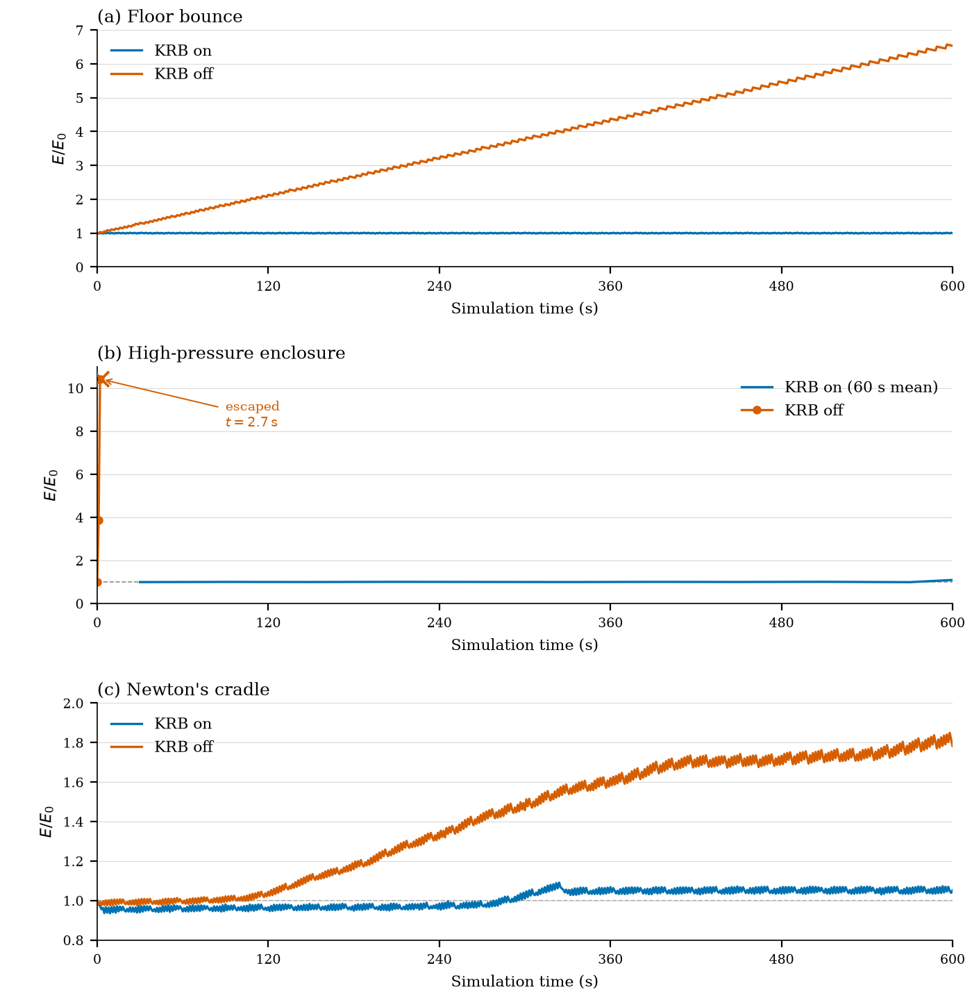
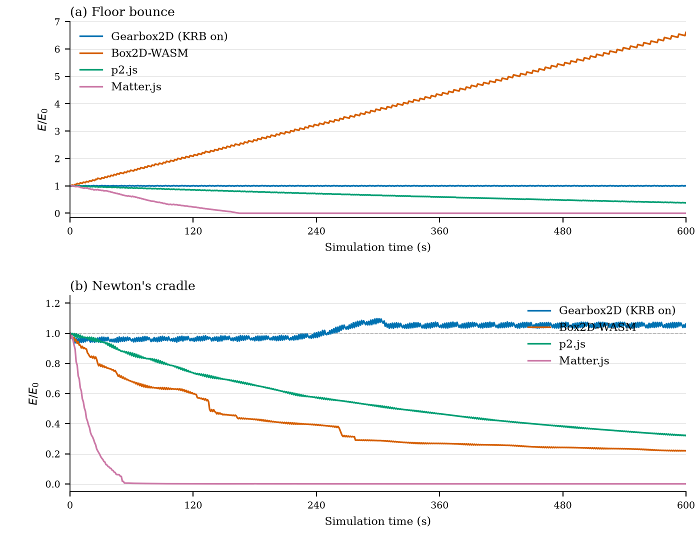

**Author:** Joshua Sideris  
**Date:** January 17, 2026 (Updated August 21, 2026)  
**Subject:** Eliminating Artificial Energy Gain in Single-Pass Impulse Solvers via Kinematic Restitution Balancing

# Kinematic Restitution Balancing (KRB)
**A Per-Constraint Energy Audit for Velocity-Level Impulse Solvers**

## Abstract
In discrete physics simulations using velocity-level impulse solvers (Sequential Impulse / Projected Gauss-Seidel), energy gain is a common numerical artifact. This paper introduces **Kinematic Restitution Balancing (KRB)**, a per-constraint correction for that leak in both unilateral constraints (collisions) and bilateral constraints (joints). By compensating for force-induced velocity drift (Component A) and auditing potential-energy shifts during position correction (Component B), KRB audits the two usual analytic SI energy leaks at per-constraint `preSolve` setup inside a single-pass SI/PGS pipeline, without a second position pass or extra PGS iterations. The empirical switch is full KRB on/off only; the compile-time floor, enclosure, and cradle ablations do not isolate which leak each component closed. The per-constraint audit does not claim a global energy invariant; coupled constraints (e.g. Newton's cradle offsets) can still exchange systemic potential-energy work.

---

## 1. The Problem: Artificial Energy Sources
In a standard velocity-level impulse solver, two sources contribute to artificial mechanical energy gain during constraint resolution:

### 1.1 External Force Integration Drift
Most engines use Symplectic Euler integration [9] where velocity is updated before constraint resolution:

$$v_{solver} = v_{t} + a_{ext} \cdot \Delta t$$

Restitution and joint logic see $v_{solver}$ instead of the true relative velocity $v_{impact}$. For a perfect bounce ($e=1.0$), the launch velocity becomes $-(v_{t} + a_{ext} \cdot \Delta t)$, gaining $a_{ext} \cdot \Delta t$ extra speed per frame. For a joint at rest, the solver sees a non-zero velocity induced by gravity and applies an impulse to cancel it, effectively "fighting" gravity every frame at the velocity level, which can lead to artificial stiffness or damping artifacts.

### 1.2 Potential Energy Shift from Position Correction
Overlap and joint error resolution (Baumgarte stabilization [1], soft constraints [5]) displaces objects by $\Delta h$ to resolve penetration or joint drift. This displacement increases potential energy ($mgh$) without reducing kinetic energy. The added PE converts to KE on subsequent frames, causing runaway energy growth, which manifests as bouncing after a collision or runaway jitter in long joint chains.

Split impulse and equivalent decoupled position passes (e.g., a separate NGS position solver) [3], [4] prevent the *immediate* bounce-from-Baumgarte by keeping position-correcting impulses off the physical velocity used for restitution. They do not, however, account for the potential-energy work of the remaining displacement $\Delta h$. That leftover PE still becomes KE on later frames, which is the gap Component B closes.

---

## 2. Related Work
Interactive rigid-body solvers and their energy artifacts are surveyed by Bender, Erleben, and Trinkle [10]. The notes below are a starting map of the work KRB sits against; they are not a complete literature review.

### 2.1 Velocity-Level Iterative Solvers
Catto's projected Gauss-Seidel / sequential-impulse formulation [2] is the standard real-time approach: constraints are solved at the velocity level with a fixed iteration count, warm starting, and accumulated-impulse clamping. Box2D and most game engines descend from this model. Because the solve happens after explicit force integration, restitution and joint bias see $v_t + a_{ext} \Delta t$ rather than the pre-force impact velocity. Component A is a correction for that pipeline, not a replacement for PGS.

### 2.2 Position Correction: Baumgarte, Split Impulse, and NGS
Baumgarte stabilization [1] feeds a fraction of the constraint error back as a velocity bias, $v_{bias} = \beta C / \Delta t$. It is cheap and universal, but the resulting displacement does work against external fields without a matching kinetic-energy change—the leak in §1.2.

Split impulse and nonlinear Gauss-Seidel (NGS) position solvers [3], [4] were introduced to stop Baumgarte from becoming visible bounce. The position pass uses pseudo-velocities that never write back into the physical velocity used for restitution. That removes the *immediate* bounce-from-correction artifact. It does not tax the leftover potential-energy change from the remaining $\Delta h$. Catto's later Solver2D comparison [4] treats NGS, soft constraints [5], TGS, and XPBD as alternative ways to hide or damp that response; none of them perform the kinematic PE/KE audit that Component B applies.

### 2.3 Dual-Pass and Temporal Solvers
PhysX Temporal Gauss-Seidel (TGS) [8] and equivalent sub-stepped / dual-pass schemes improve convergence and can reduce energy injected while correcting penetrations, at extra cost per step. KRB targets the opposite trade: keep a single-pass sequential-impulse profile, and cancel the two analytic energy sources instead of iterating them away.

### 2.4 Position-Based Alternatives
Position Based Dynamics [6] and XPBD [7] resolve constraints by projecting positions, then backing out velocities. That sidesteps velocity-level restitution bias, but it is a different solver family: stiffness becomes a compliance / iteration parameter, and the engine is no longer a drop-in SI/PGS stack. KRB is meant for engines that want to keep velocity-level impulses.

### 2.5 Geometric Integration
Symplectic Euler is a first-order geometric integrator [9]. Variational / structure-preserving integrators can bound long-term energy drift for unconstrained Hamiltonian systems. KRB is not a variational integrator. It is a per-constraint energy audit layered on an existing SI pipeline, and it does not claim the global conservation properties of that literature. Section 7 states the coupled-constraint gap that follows from that choice.

### 2.6 The Gap
Prior velocity-level practice either (a) accepts Baumgarte energy gain, (b) hides the bounce with a second position pass, or (c) leaves the velocity-level stack for PBD/XPBD. Among the SI variants cited here, none apply an analytic PE/KE balance to the expected correction displacement $\Delta h$ at solver setup, for both contacts and joints, inside a single-pass impulse solver. That is the claim KRB makes.

---

## 3. The Solution: Kinematic Restitution Balancing
KRB performs an energy audit during constraint resolution via two independent corrections.

### 3.1 Component A: Force Velocity Compensation
With symplectic Euler, integration updates velocity before the constraint solve ($v_{solver} = v_t + a_{ext} \cdot \Delta t$), so restitution and joint bias see force-induced drift rather than the pre-force relative velocity. Track the per-body increment $v_{force} = a_{ext} \cdot \Delta t$ during integration and subtract it at setup to recover the true impact velocity before restitution or bias is applied:

$$v_{impact} = v_{relative} - (v_{force,B} - v_{force,A})$$

This correction applies to **all constraints** whenever Symplectic Euler integration is used, independent of the bias method. It calculates the constraint's corrective impulses relative to the force-induced velocity field.

### 3.2 Component B: Kinematic Energy Balancing
Baumgarte position correction displaces bodies by an expected distance $\Delta h$ along the constraint normal. Component B applies a one-dimensional work–energy identity along $\mathbf{n}$ only: external forces do work $W = m (\mathbf{a}_{ext} \cdot \mathbf{n}) \Delta h$ over that displacement, and the launch or bias speed is adjusted using $\Delta(\tfrac12 v^2) = W$ on the *relative* normal velocity (Listing 1: `workTerm` with `forceVn` $= v_{force,B}-v_{force,A}$ dotted with $\mathbf{n}$; masses cancel). This is not a rigid-body work–energy theorem—tangential motion, $I\omega^2$, and PGS impulse power are out of scope—and $\Delta h$ is the *expected* Baumgarte displacement this step ($d_{eff}$, cap, $\Gamma$; §3.3), not the work of impulses the solver actually applied. That gives a surface speed $v_{surf}^2 = v_{impact}^2 + 2 (\mathbf{a}_{ext} \cdot \mathbf{n}) \Delta h$. When available kinetic energy cannot pay the tax, clamp with $\max(0,\cdot)$ and apply restitution:

$$v_{surf} = \sqrt{\max(0, v_{impact}^2 + 2 (\mathbf{a}_{ext} \cdot \mathbf{n}) \Delta h)}$$

Yielding a final velocity of:

$$v_{final} = e \cdot v_{surf} = e \sqrt{\max(0, v_{impact}^2 + 2 (\mathbf{a}_{ext} \cdot \mathbf{n}) \Delta h)}$$

The equation is symmetric: ground collisions ($\mathbf{a}_{ext} \cdot \mathbf{n} < 0$) tax the launch velocity to pay for increased PE, while ceiling collisions ($\mathbf{a}_{ext} \cdot \mathbf{n} > 0$) boost it to account for work done against external forces.

### 3.3 Effective Displacement Prediction
$\Delta h$ is the expected normal displacement used in the Component B work term—the portion the position solver will actually correct this step after launch motion and per-iteration caps. In solvers that use split impulse or an equivalent decoupled position pass (Sequential Impulse followed by Position Iterations), the energy audit must account for the temporal separation between the velocity and position phases. Specifically, the kinematic bounce velocity $v_{launch}$ partially resolves overlap after penetration slop $s$ during the subsequent integration step before the position solver operates. The remaining overlap after that motion is the effective depth:

$$d_{eff} = \max(0, (d - s) - (v_{launch} \cdot \Delta t))$$

Furthermore, many solvers clamp the position correction per iteration to $\Delta h_{max}$ (e.g., `0.2f`). To ensure the energy audit remains consistent with the physical work performed, the balancing term must respect these constraints:

$$\Delta h = \min(d_{eff}, \Delta h_{max}) \cdot \Gamma$$

Where $\Gamma = 1 - (1 - \beta)^n$ is the cumulative Baumgarte fraction applied over $n$ position iterations with factor $\beta$.

---

## 4. Constraint-Specific Application

### 4.1 Unilateral Constraints (Collisions & Speculative)
For physical collisions, both **Component A and Component B** are required to balance the energy injected by the positional correction.

Speculative contacts, however, are created *before* overlap occurs to prevent high-speed objects from tunneling. In these cases, the penetration $d$ is negative ($d < 0$), representing a gap. Because the objects are not yet touching, **Component B is not required** ($\Delta h = 0$), as there is no position correction work to balance. However, **Component A remains critical**. Without it, speculative contacts would "see" gravity-induced velocity as part of the impact speed, causing objects to bounce off "thin air".

### 4.2 Bilateral Constraints (Joints) & The Zero-Velocity Paradox
Bilateral constraints (joints) aim to maintain a target relative velocity of zero. 

Early revisions of KRB suggested entirely omitting Component B for joints to prevent a "numerical dead zone" (the Zero-Velocity Paradox) where a joint "cannot afford the energy tax" to fix small position errors if the objects are at rest.

However, completely omitting Component B creates a subtle but persistent **energy leak**. When the positional solver (Baumgarte) performs work against gravity to correct joint stretch, doing so without a corresponding reduction in kinetic energy injects artificial energy into the system every frame. In oscillatory setups like a Newton's Cradle, this manifests as accumulated sway and instability.

To keep the joint from injecting that leak, **Component B must be applied to joints**, but capped so a resting constraint is not paralyzed. The ideal correction velocity $v_{bias} = \frac{\beta}{\Delta t} C(\mathbf{x})$ demands a kinetic energy cost of $v_{bias}^2$. If the work term implies we are fighting gravity, we must audit the energy:

$$v_{bias\_actual} = \sqrt{\max(0, v_{bias}^2 - 2 (\mathbf{a}_{ext} \cdot \mathbf{n}) (\beta C))}$$

Equation above is the same PE/KE audit with expected stretch displacement $\beta C$ in place of contact $\Delta h$. If the available kinetic energy cannot pay the potential energy tax, the joint allows a microscopic amount of "Baumgarte sag." That prefers a bounded energy audit over infinite stiffness at rest—which is physically accurate, as a resting pendulum requires tension and a tiny amount of stretch to hang.

---

## 5. Implementation

### 5.1 Collisions (Component A + B)
The implementation requires storing $v_{force} = a_{ext} \cdot \Delta t$ per body during integration, then applying the correction during solver setup:

```
// Component A: True impact velocity
v_impact = v_relative - (v_force_B - v_force_A)

// Component B: Energy-balanced launch velocity  
v_bounce = -e * v_impact
d_eff = max(0, (depth - slop) - v_bounce * dt)
h_expected = min(d_eff, MAX_POSITION_CORRECTION) * cumulative_factor
v_surf = sqrt(max(0, (v_impact)² + 2 * dot(a_ext, n) * h_expected))
v_final = e * v_surf
```

### 5.2 Distance Joints (Component A + B)
For joints, we calculate the bias using both Component A and a modified Component B.

```cpp
// Component A: Force Velocity Compensation
float forceVn = (bodyB->forceVelocity - bodyA->forceVelocity).dot(normal);

// Theoretical ideal velocity needed to fix error
float v_bias_ideal = beta * C / dt;

// Component B: Energy Audit for the correction work
float expectedDisplacement = v_bias_ideal * dt; 
float accVn = forceVn / dt;
float workTerm = 2.0f * accVn * expectedDisplacement;

float v_bias_sq = v_bias_ideal * v_bias_ideal;
// Bidirectional energy audit
float adjusted_v_bias_sq = max(0.0f, v_bias_sq - workTerm);
float v_bias_actual = sqrt(adjusted_v_bias_sq);
// Force compensation (-forceVn) is folded into the bias here to avoid
// subtracting it from relative_vn during every solver iteration.
bias = (v_bias_ideal > 0 ? v_bias_actual : -v_bias_actual) - forceVn;

// During the iterative solve phase:
float relative_vn = v_relative.dot(normal);
float lambda = -mass * (relative_vn + bias);
```

---

## 6. Results
Four datasets: Datasets A–B energy runs last $600\,\mathrm{s}$; Dataset C KRB-on continuation lasts $8\,\mathrm{h}$ ($t = 28800\,\mathrm{s}$); Dataset D reports native `world.step()` wall-time only. Figure 1 is a compile-time ablation of the Gearbox2D sequential-impulse solver: the default binary (KRB on) versus the same sources built with `-DGEARBOX_DISABLE_KRB`. Figure 2 places that KRB-on build next to unmodified Box2D-WASM, p2.js, and Matter.js. Dataset C traces are in `data/dataset-c/`; Dataset D in `data/timing/`. We do not report a patched-Box2D result. An earlier Box2D v3 port used an older revision of the method; those energy-gain and CPU-overhead numbers are withdrawn.

Energy results in this paper use $dt = 1/60$, $e = 1$, zero friction and damping, sleep disabled throughout. Datasets A and C use stock `World()` plus `constants.h`: `velocity_iterations=50`, `position_iterations=10`, $\beta = 0.2$, `MAX_POSITION_CORRECTION=0.2`, slop $0.016$, restitution threshold $0.01$; Listing 1 $\Gamma$ uses that $n,\beta$. Dataset B engines are unmodified whole-engine WASM traces (not those Gearbox knobs). Full KRB on/off only (no A-only/B-only traces); the compile-time ablation scenes do not isolate which leak each component closed. Mechanical energy is $E = E_k + E_p$. Dataset A includes rotational KE; Dataset B is translational only. The reported ratio is $E/E_0$. Instantaneous samples alias the bounce; $60\,\mathrm{s}$ windowed means are the drift signal; the enclosure series uses $600\,\mathrm{s}$ windows on the $8\,\mathrm{h}$ trace.

| Set | Scene | Horizon | Surface | Outcome / metric |
| :--- | :--- | :--- | :--- | :--- |
| A | all | $600\,\mathrm{s}$ | native `log-energy` | Table A |
| B | floor, cradle | $600\,\mathrm{s}$ | WASM `benchmarks.html` | Table B |
| C | enclosure | $8\,\mathrm{h}$ | native `log-energy` | in box; 600 s win. $1.009 \to 0.977$ |
| C | cradle | $8\,\mathrm{h}$ | native `log-energy` | $E/E_0 \in [1.034, 1.093]$; mean $1.053$ |
| D | A scenes + stack | timed steps | native `g++` | Table D |

### 6.1 Ablation (Dataset A)
Traces and the logger are in `data/*-{krb,nokrb}.csv` and `log-energy.cpp`.



**Figure 1.** Mechanical energy ratio over $600\,\mathrm{s}$. (a) Single elastic floor contact. (b) High-rate enclosure; KRB on is a 60 s windowed mean, KRB off is raw 1 Hz samples terminating at tunneling ($t = 2.7\,\mathrm{s}$). (c) Newton's cradle (coupled contacts and joints). Vector original: `figures/fig-energy-ablation.pdf`.

| Scene | KRB | $E/E_0$ at $600\,\mathrm{s}$ | Windowed mean | Outcome |
| :--- | :--- | ---: | :--- | :--- |
| Floor bounce | on | $0.999$ | $1.000$ | bounded |
| Floor bounce | off | $6.53$ | climbing | runaway |
| High-pressure circle | on | — | $1.00$ | stayed in box |
| High-pressure circle | off | — | — | escaped, step $161$ |
| Newton's cradle | on | $1.07$ | $1.05$ after $t=300$ | bounded offset |
| Newton's cradle | off | $1.79$ | climbing | secular gain |

Contact-only scenes match §1. With KRB, the floor bounce stays at $E/E_0 = 1.000 \pm 0.001$ in every 60 s window and never exceeds its start height. Without KRB the same drop gains about $0.55\,E_0$ per minute and finishes at $E/E_0 = 6.53$, with the apex 50 length units above the release. The high-pressure enclosure is the same leak at a higher impact rate: KRB window means stay at $1.00$ for the full run; without KRB the body leaves the box after $2.7\,\mathrm{s}$ at $E/E_0 \approx 10$. Instantaneous 1 Hz samples of the on-curve swing between $0.67$ and $1.33$ because they alias the bounce; the windowed mean is the drift signal.

The cradle is better with KRB but is not an invariant, which is the coupled-constraint gap in Section 7. Without KRB, $E/E_0$ climbs from $1.00$ to $1.79$ and outer-ball peak height from $1.35$ to $2.43$. With KRB, energy sits slightly low ($\sim 0.96$) for four minutes, steps to $\sim 1.07$ around $t = 240$–$300\,\mathrm{s}$, then plateaus or slightly decays ($1.072 \to 1.054$). That is a bounded offset, not the linear SI ramp. Dataset C long-horizon checks are in the protocol table above.

### 6.2 Stock engines (Dataset B)
Figure 2 uses the same floor-bounce and cradle setups, logged from `site/benchmarks.html` at 1 Hz of simulation time. Gearbox2D is the default KRB-on WASM build. Box2D-WASM, p2.js, and Matter.js are unmodified. This is cross-engine placement, not causal evidence that KRB explains Gearbox versus the other engines; Dataset A is the compile-time on/off ablation. Traces are in `data/dataset-b-*-600s.csv`.



**Figure 2.** Mechanical energy ratio over $600\,\mathrm{s}$ on unmodified engines. (a) Elastic floor contact. (b) Newton's cradle. Vector original: `figures/fig-energy-engines.pdf`.

| Scene | Engine | $E/E_0$ at $600\,\mathrm{s}$ | Outcome |
| :--- | :--- | ---: | :--- |
| Floor bounce | Gearbox2D (KRB on) | $0.999$ | bounded |
| Floor bounce | Box2D-WASM | $6.61$ | runaway |
| Floor bounce | p2.js | $0.376$ | slow loss |
| Floor bounce | Matter.js | $\approx 0$ | dead by $t\approx 160\,\mathrm{s}$ |
| Newton's cradle | Gearbox2D (KRB on) | $1.062$ | bounded offset |
| Newton's cradle | Box2D-WASM | $0.221$ | stepped loss |
| Newton's cradle | p2.js | $0.320$ | slow loss |
| Newton's cradle | Matter.js | $\approx 0$ | dead by $t\approx 40\,\mathrm{s}$ |

The floor bounce is the contact leak from §1 in a production SI engine. Box2D-WASM climbs to $E/E_0 = 6.61$, matching Gearbox with KRB off ($6.53$) to a few percent. Gearbox with KRB on stays at $1.000 \pm 0.001$ in every 60 s window, as in Figure 1a. p2.js and Matter.js fail the other way: they dissipate, Matter reaching rest by $t\approx 160\,\mathrm{s}$.

The cradle is a different regime—elastic contacts plus joints—and the other engines lose energy rather than gain it. Matter is done by $t\approx 40\,\mathrm{s}$. Box2D-WASM falls in steps to $0.22$ (restitution velocity threshold plus Baumgarte on the rods). p2.js drains smoothly to $0.32$. Gearbox repeats Figure 1c: a $\sim 7\%$ step near four minutes, then a plateau. That is the empirical bound in Section 7, not a claim that the other engines share the SI gain of Figure 2a.

### 6.3 Cost (Dataset D)
The analytic cost claim is checkable without a second solver pass. Per dynamic body at integrate, KRB stores `forceVelocity = a_ext * dt` (two floats). Per contact `preSolve` when KRB is on: a `forceVn` dot, optional $\Gamma$, a `workTerm`, one `sqrt`, and a bias update. Per distance-joint `preSolve`: `forceVn`, `workTerm`, one `sqrt`, with `-forceVn` folded into `bias`. There are zero extra PGS, velocity, or position iterations—not a second position pass or coupled-island PE tax. Whole-step `world.step()` timings may include hinge Component A (engine-only); the listed recipe and implementation listings cover contacts and distance joints only (wall-time is scene-dependent).

Dataset D times `world.step()` on the same native `g++` binary with compile-time KRB on versus `-DGEARBOX_DISABLE_KRB` (`BENCH_FLAGS`: `-O3 -march=native -mfma -pthread -DGEARBOX_MT`). The product ships WASM; these numbers are a native ablation a reviewer recaptures via `make log-timing`. This is **not** a Gearbox-versus-Box2D CPU comparison (Dataset B is whole-engine energy, not in-engine ablation). Traces and the logger are in `data/timing/timing-summary-{krb,nokrb}.csv` and `log-timing.cpp`.

Scenes reuse Dataset A geometry for floor bounce, the high-pressure enclosure, and the cradle ($dt = 1/60$, $e = 1$, sleep off). Protocol: 100 warmup steps, then 1000 timed steps; three repeats; mean and range across repeats in ms/step (capture: i9-9900KF, g++ 13.3.0, `velocity_iterations=50`, `position_iterations=10`). We do not report a vanity percent speedup. Floor bounce and cradle on/off sit in the same scatter band. High-pressure circle KRB-off escapes early (Dataset A enclosure); on/off timings are not a same-contact-load comparison—do not read the spread as KRB overhead. A denser `large-stack` row (not Dataset A) is included for contact load; on/off also overlap ($\sim 0.38\,\mathrm{ms}/\mathrm{step}$).

| Scene | KRB on mean (range) ms/step | KRB off mean (range) ms/step | Notes |
| :--- | ---: | ---: | :--- |
| Floor bounce | $0.010$ ($0.005$–$0.018$) | $0.009$ ($0.005$–$0.017$) | Dataset A |
| High-pressure circle | $0.012$ ($0.012$–$0.013$) | $0.006$ ($0.006$–$0.007$) | Dataset A |
| Newton's cradle | $0.048$ ($0.047$–$0.048$) | $0.049$ ($0.047$–$0.050$) | Dataset A |
| Large stack | $0.377$ ($0.372$–$0.381$) | $0.375$ ($0.369$–$0.380$) | not Dataset A |

---

## 7. Known Limitations
KRB is a per-constraint audit, not a coupled one; resolving one constraint can force work on another.

**Evaluation regime.** In scope: single-pass SI/PGS, symplectic Euler (Component A not evaluated on other integrators), contacts and distance joints, $e = 1$, zero friction/damping, sleep off, and the Gearbox `World()`/`constants.h` knobs in §6. Energy results in this paper are reported only for this regime; friction, $e < 1$, other $dt$, or different iteration counts are out of scope. Shown limits: coupled cradle $\sim 7\%$ step then $E/E_0 \in [1.034, 1.093]$ (mean $1.053$) through $8\,\mathrm{h}$; Dataset C enclosure slow loss $1.009 \to 0.977$; speculative contacts omit Component B; joint sqrt cap; KRB-off enclosure escape is SI leak; unmodified Box2D/p2/Matter dissipate rather than gain. Out of scope: frictional or $e < 1$ games, hinges (engine-only), XPBD/TGS, global conservation. Variational integrators [9] are a different claim.

No A-only/B-only ablation; full KRB versus `-DGEARBOX_DISABLE_KRB` is the measured switch. Dataset B is placement only (§6.2). Coupled-constraint audit, tunneling, and ill-conditioned chains remain future work.

---

## 8. Conclusion
Kinematic Restitution Balancing is a drop-in correction for velocity-level sequential-impulse solvers [2]. Component A compensates symplectic-Euler force drift at setup; Component B taxes (or credits) the launch or bias velocity for the potential-energy work of the expected correction displacement $\Delta h$. Both apply to contacts and distance joints, at the cost of a few extra scalars per constraint setup (§6.3 / Dataset D table). Coupled cradle scenes show a bounded $E/E_0$ offset after an early step, not full cradle compensation. KRB-on is not a perfect energy meter: the Dataset C enclosure drifts slowly ($1.009 \to 0.977$), i.e. loss not conservation and not the KRB-off SI gain of Dataset A.

That is a narrower claim than a dual-pass solver or a reduced-coordinate formulation. Split impulse and NGS [3], [4], [8] still hide Baumgarte bounce by keeping position work off the physical velocity; KRB does not replace that machinery, and it does not match their convergence behavior. It audits the two analytic leaks in §1 at per-constraint setup inside a single-pass SI profile, with the coupled-constraint gap in Section 7 left open.

---

## References

[1] J. Baumgarte, "Stabilization of Constraints and Integrals of Motion in Dynamical Systems," *Computer Methods in Applied Mechanics and Engineering*, vol. 1, no. 1, pp. 1–16, 1972. doi: [10.1016/0045-7825(72)90018-7](https://doi.org/10.1016/0045-7825(72)90018-7)

[2] E. Catto, "Iterative Dynamics with Temporal Coherence," presented at the Game Developers Conference, San Francisco, CA, 2005. [Online]. Available: https://box2d.org/files/ErinCatto_IterativeDynamics_GDC2005.pdf

[3] E. Catto, "Understanding Constraints," presented at the Game Developers Conference, San Francisco, CA, 2014. [Online]. Available: https://box2d.org/files/ErinCatto_UnderstandingConstraints_GDC2014.pdf

[4] E. Catto, "Solver2D," *Box2D*, Feb. 2024. [Online]. Available: https://box2d.org/posts/2024/02/solver2d/

[5] E. Catto, "Soft Constraints," presented at the Game Developers Conference, San Francisco, CA, 2011. [Online]. Available: https://box2d.org/files/ErinCatto_SoftConstraints_GDC2011.pdf

[6] M. Müller, B. Heidelberger, M. Hennix, and J. Ratcliff, "Position Based Dynamics," *Journal of Visual Communication and Image Representation*, vol. 18, no. 2, pp. 109–118, 2007. doi: [10.1016/j.jvcir.2007.01.005](https://doi.org/10.1016/j.jvcir.2007.01.005)

[7] M. Macklin, M. Müller, and N. Chentanez, "XPBD: Position-Based Simulation of Compliant Constrained Dynamics," in *Proc. 9th ACM SIGGRAPH Conference on Motion in Games (MIG)*, Burlingame, CA, 2016, pp. 49–54. doi: [10.1145/2994258.2994272](https://doi.org/10.1145/2994258.2994272)

[8] NVIDIA Corporation, "Rigid Body Dynamics," *PhysX SDK 5.4 Documentation*, 2024. [Online]. Available: https://nvidia-omniverse.github.io/PhysX/physx/5.4.1/docs/RigidBodyDynamics.html

[9] E. Hairer, C. Lubich, and G. Wanner, *Geometric Numerical Integration: Structure-Preserving Algorithms for Ordinary Differential Equations*, 2nd ed., Springer Series in Computational Mathematics, vol. 31. Berlin, Germany: Springer-Verlag, 2006. doi: [10.1007/3-540-30666-8](https://doi.org/10.1007/3-540-30666-8)

[10] J. Bender, K. Erleben, and J. Trinkle, "Interactive Simulation of Rigid Body Dynamics in Computer Graphics," *Computer Graphics Forum*, vol. 33, no. 1, pp. 246–270, 2014. doi: [10.1111/cgf.12272](https://doi.org/10.1111/cgf.12272)
